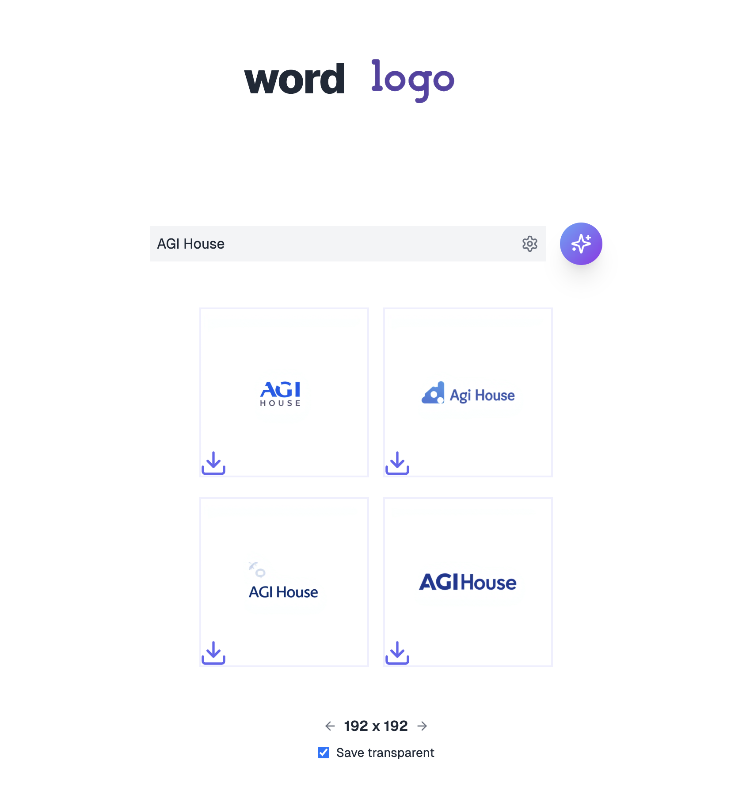

# Word Logo Generator
A simple app to generate logos using LoRa fine-tuned image generator on labeled textual logos hosted on fal.ai.

## About

This project was built during the AGI House Flux LoRa hackathon. It leverages advanced AI techniques to create unique and stylish text-based logos on demand.

1. Powered by LoRa fine-tuned Flux image generator
2. Labeled textual logo dataset

## Technologies

- [TypeScript](https://www.typescriptlang.org)
- [Next.js](https://nextjs.org)
- [React](https://reactjs.org)
- [Tailwind CSS](https://tailwindcss.com)
- [fal.ai](https://fal.ai)
- [LoRa](https://arxiv.org/abs/2106.09685) (Low-Rank Adaptation)
- Flux

## Getting Started

1. Clone the repository
2. Install dependencies: `npm install`
3. Run the development server: `npm run dev`
4. Open [http://localhost:3000](http://localhost:3000) in your browser

## Contributing

Contributions are welcome! Please feel free to submit a Pull Request.

## Acknowledgements

- AGI House for organizing the Flux LoRa hackathon
- fal.ai for the easy to use API and free credits!
